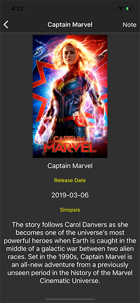

#Practica App en React Native

- Datos de una API publica. (API Referencia Moviedb)
- Uso de FlatList
- Vista Detalle
- Pull to Refress
- Formulario Funcional
- Uso de React Native Router Flux
- Uso de React Native Image Picker

Pruebas de desarrollo en iOS

